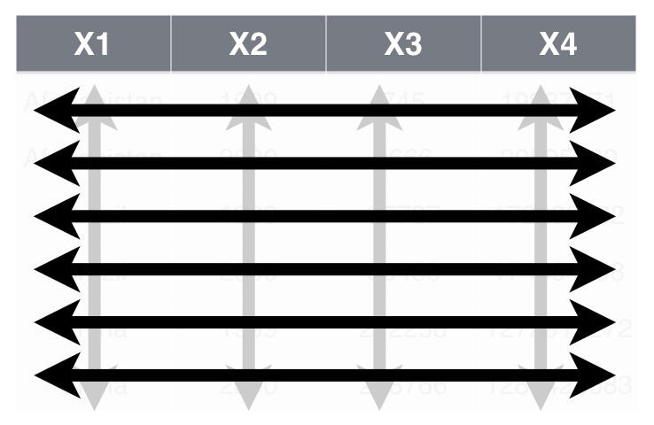
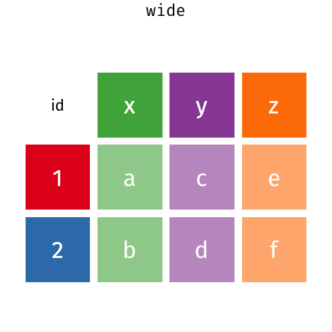

```{r setup, include=FALSE, cache=FALSE}
# Set global R options
options(htmltools.dir.version = FALSE, servr.daemon = TRUE)
setwd("/Users/b294776/Desktop/workspace/training/UC/uc-bana-6043/instructor-material/module-4")

# Set global knitr chunk options
knitr::opts_chunk$set(
  fig.align = "center", 
  collapse = TRUE 
)

library(here)
```

class: clear, center, middle

background-image: url(../images/cleaning.gif)
background-size: cover

<br><br><br><br><br><br><br><br><br><br><br><br>
.font300.bold.white[Tidy Data]

---

# Tidy Data

<br><br>
```{r tidy-ds-task, echo=FALSE}
knitr::include_graphics("../images/tidy-task.png")
```

---

class: yourturn
# Your Turn!

.center.font130[What are the variables in this data set?]

```{r your-turn-1, echo=FALSE, message=FALSE, warning=FALSE}
library(tidyverse)

read_rds("data/bomber_wide.rds") %>%
  pivot_longer(cols = -c(Type, MD), names_to = "Year", values_to = "Flying_Hours") %>%
  kableExtra::kable() %>%
  kableExtra::kable_styling()
```

---

class: yourturn
# Your Turn!

.center.font130[What are the variables in this data set?]

```{r your-turn-2, echo=FALSE}
read_rds("data/bomber_wide.rds") %>%
  kableExtra::kable() %>%
  kableExtra::kable_styling()
```

---

class: yourturn
# Your Turn!

.center.font130[What are the variables in this data set?]

```{r your-turn-3, echo=FALSE}
read_rds("data/bomber_long.rds") %>%
  arrange(MD, FY) %>%
  kableExtra::kable() %>%
  kableExtra::kable_styling()
```


---

# Tidy data simplifies life

.pull-left[

<br><br>
.font130[

A data set is tidy if:

1. Each .blue[__variable__] in in its own .blue[__column__]

2. Each .red[__observation__] is in its own .red[__row__]

3. Each .grey[__value__] is in its own .grey[__cell__]

]
]

.pull-right[
<br><br>

```{r tidy-data-example, echo=FALSE}

```

]

---

# Reshaping

.pull-left[

You are going to learn a few key __pandas__ functions that allow you to solve your data reshaping challenges:

- `.melt()`: make wide data long.

- `.pivot()`: make long data width.

- `.pivot_table()`: same as `.pivot()` but can handle multiple indexes.

]

.pull-right[

<br>

```{r tidyr-hex, echo=FALSE, out.width="50%", out.height="50%"}

```

]
